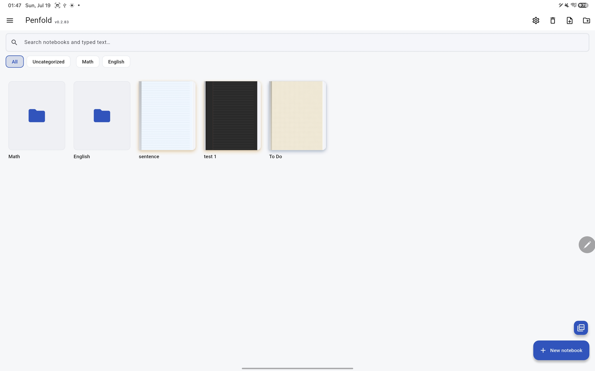
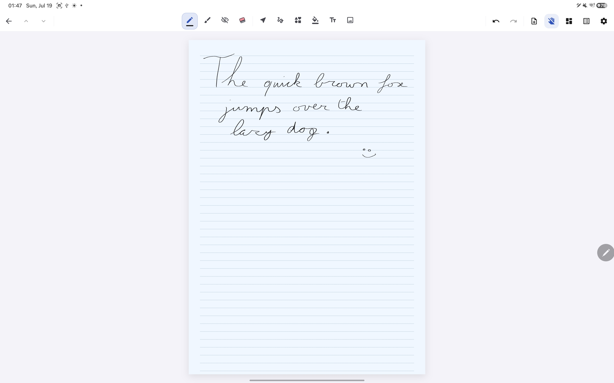
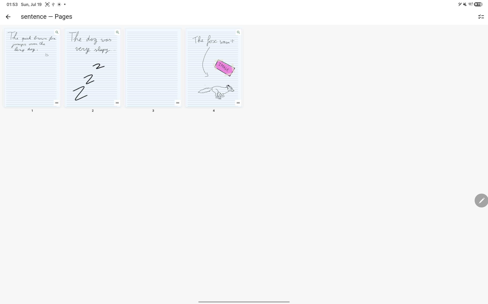
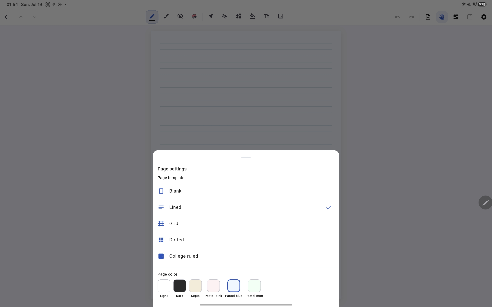
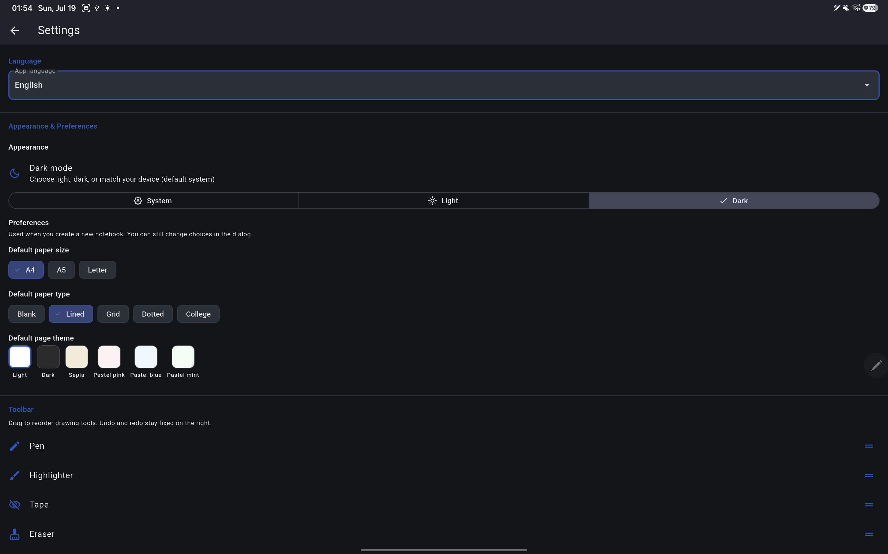
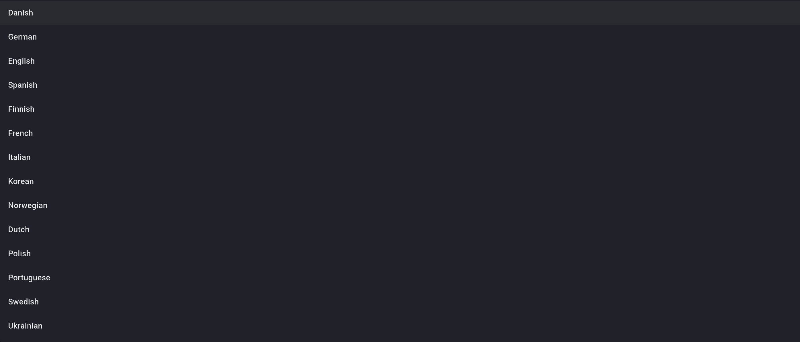
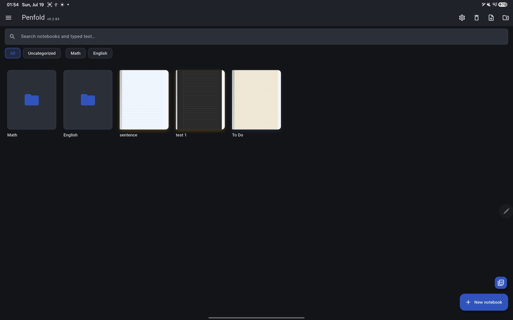
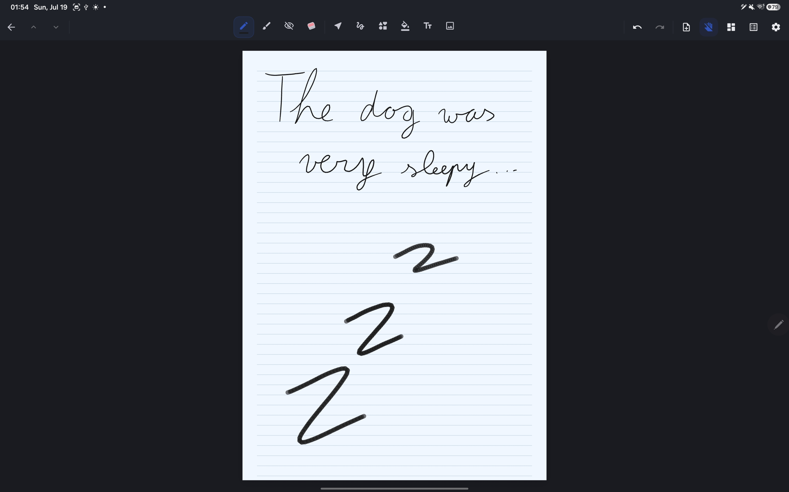
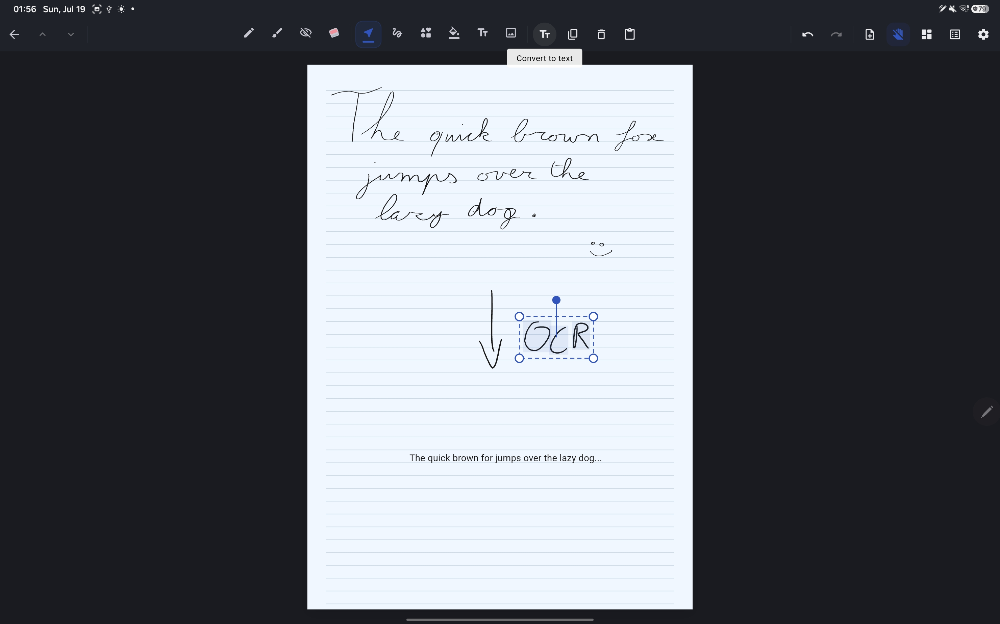

<p align="center">
  
</p>

<h1 align="center">Penfold</h1>

<p align="center">
  <strong>A private, local-first handwriting notebook for Android.</strong><br/>
  <em>(Tested on Galaxy Tab with S Pen; should work on other Android devices)</em><br/>
  No account. No subscription. No cloud lock-in. Your notes stay on your device.
</p>

<p align="center">
  <a href="https://github.com/BlommeJan/penfold"></a>
  <a href="https://flutter.dev"></a>
  <a href="https://www.android.com"></a>
  <a href="LICENSE"></a>
</p>

<p align="center"><sub><span style="color:red">This project was developed with assistance from AI tools.</span></sub></p>

---

Penfold is a Flutter app that brings a **GoodNotes-style handwriting workflow** to Android tablets and phones — without the account, subscription, or cloud dependency. **Your notes never leave your tablet unless you choose to export or back up.**

Unlike apps that require sign-in and sync everything to a vendor cloud, Penfold stores every stroke, image, folder, and search index in a single SQLite database on your device. Open the app, pick up your stylus, and write — no login step, no waiting for sync.

### Why local-first?

- **No account, no login** — open the app and start writing; nothing to sign up for
- **Works fully offline** — everyday writing, organizing, search, and export need no internet
- **Notes stored on your device only** — ink and files live in local storage, not a remote server
- **No cloud sync, no telemetry** — Penfold does not upload your notebooks or collect analytics
- **You control export & backup** — share PDFs/PNGs or zip your database when you want a copy
- **Device-to-device sync not shipped yet** — optional peer-to-peer sync may come later; today there is no automatic sync between tablets or phones

Handwriting search (OCR) is optional: the first time you use it, a small on-device model may download once; after that, recognition runs locally with no account.

| | |
|---|---|
| **Private by design** | All data in one inspectable `penfold.db` file on device |
| **Stylus-first** | Palm rejection, pressure sensitivity, S Pen hover and barrel-button support |
| **Organized library** | Nested folders, tags, trash, full-text search, colored notebook covers |
| **Rich ink tools** | Pen, pencil, highlighter, tape (hide-reveal), shapes, fill, text, lasso |
| **PDF import** | Lazy-render pages with embedded text search and read-only hyperlinks |

See [CHANGELOG.md](CHANGELOG.md) for release history.

---

## Features

| Area | What you get in v0.3.2 |
|------|-------------------------|
| **Library** | Colored covers with first-page thumbnails, nested **folders**, **tags** with filter chips, **trash** (30-day retention, restore or delete), full-text search, PDF import, session persistence |
| **Drawing tools** | Pressure-sensitive pen styles, highlighter, whole-stroke and pixel eraser, shape recognition, flood fill, typed text, lasso with copy/paste and rotate/scale handles, 100-step undo/redo per page |
| **Document zoom** | Pinch zoom, two-finger pan, double-tap reset, bounds clamping; finger scroll works in stylus-only mode at 1× |
| **OCR** | On-device handwriting recognition (ML Kit), ink search index, convert selection to text, custom dictionary, table-of-contents heading detection |
| **S Pen** | Hover brush preview, barrel-button hold-to-erase (configurable in settings), palm rejection |
| **Export** | Current page or full notebook as **PNG** or vector **PDF**; long-press notebook → export workbook PDF |
| **Backup** | Full-database zip export/restore via share sheet; “Your data” screen shows DB path and asset sizes |
| **i18n** | **14 locales** — English plus de, fr, nl, ko, pl, es, it, uk, sv, nb, fi, da, pt |
| **Dark mode** | System / light / dark theme picker with themed library, toolbar, page overview, and settings |
| **Page themes** | Per-page paper colors: light, dark, sepia, pastels (with matching ruled/grid line colors) |
| **Notebook defaults** | Default paper size, template type, and page theme for new notebooks |
| **Stroke smoothing** | Optional Chaikin smoothing (default on) with **0–100% strength slider** in Settings → Preferences |

**Pages** — Vertical scroll or optional page-turn mode; page overview grid with drag-reorder and batch delete; blank/lined/grid/dotted/college-ruled templates in A4/A5/Letter; gear menu for page settings (template, size, orientation, color, bookmark, audio, split, export); image insert; per-page audio attachment; page complexity warning at 500 strokes with split-page tool.

See [docs/ARCHITECTURE.md](docs/ARCHITECTURE.md) for folder layout, design patterns, and SQLite schema details.

---

## Quick start

**Prerequisites:** [Flutter SDK](https://docs.flutter.dev/get-started/install) 3.x (Dart ≥ 3.3), Android SDK, and a device or emulator.

```bash
git clone https://github.com/BlommeJan/penfold.git
cd penfold
flutter pub get
flutter run
```

No API keys, `.env` files, or sign-in steps are required.

For release APK builds, versioning, and the `APKs/` folder convention, see [docs/BUILD.md](docs/BUILD.md).

---

## Screenshots

Captures live in [`docs/screenshots/`](docs/screenshots/). See [docs/screenshots/README.md](docs/screenshots/README.md) for naming and capture tips.

| | |
|:---:|:---:|
| **Library** — folders, tags, colored covers | **Notebook editor** — ink tools, templates, page pill |
|  |  |
| **Page overview** — grid, reorder, OCR badge | **Page settings** — themes, template, size, export |
|  |  |
| **Settings** — toolbar order, backup, smoothing | **Languages** — 14 locale picker |
|  |  |
| **Dark mode** — library | **Dark mode** — editor |
|  |  |

**Handwriting OCR** — indexed ink and convert-to-text:



---

## Documentation

| Document | Description |
|----------|-------------|
| [CHANGELOG.md](CHANGELOG.md) | Version history (v0.1.0 – v0.3.2) |
| [docs/ARCHITECTURE.md](docs/ARCHITECTURE.md) | Code layout, design patterns, SQLite schema |
| [docs/IMPLEMENTATION_ROADMAP.md](docs/IMPLEMENTATION_ROADMAP.md) | Feature feasibility and dependency order |
| [docs/CONTRIBUTING.md](docs/CONTRIBUTING.md) | Development setup, tests, PR guidelines |
| [docs/BUILD.md](docs/BUILD.md) | Release APK build instructions |
| [docs/DEVICE_TESTING.md](docs/DEVICE_TESTING.md) | On-device feature checklist for QA |
| [docs/screenshots/README.md](docs/screenshots/README.md) | README screenshot filenames and capture guide |
| [CODE_OF_CONDUCT.md](CODE_OF_CONDUCT.md) | Community standards |
| [LICENSE](LICENSE) | MIT license |

---

## Roadmap

Penfold is under active development. v0.3.2 sharpens privacy and local-first messaging across the app and docs. v0.3.1 shipped user-test fixes for library tags, fill, tape, and color picking. v0.3.0 shipped handwriting OCR, pixel eraser, i18n, and dark mode — these are no longer open items. Planned or deferred work includes:

- **Gesture ink editing** — scratch-to-erase, underline-to-emphasize (requires reliable OCR bounds)
- **Audio with stroke sync** — page-level audio exists; per-stroke timestamps and tap-to-seek are not shipped
- **Notebook export as Markdown** — plain-text / `.md` export from OCR ink index
- **Math recognition / LaTeX export** — evaluate after core OCR is stable on device
- **Play Store listing** — privacy policy, store assets, and public release packaging
- **iOS build** — Android-first; Flutter code is largely cross-platform
- **Device-to-device sync** — not shipped; may explore optional peer-to-peer later (local-first by design)

Track progress in [CHANGELOG.md](CHANGELOG.md) and [GitHub Issues](https://github.com/BlommeJan/penfold/issues).

---

## Contributing

Issues and pull requests are welcome. Please read [docs/CONTRIBUTING.md](docs/CONTRIBUTING.md) before submitting changes.

---

<p align="center">
  <strong>Penfold v0.3.2</strong> — write freely, keep it local, stay private.
</p>
