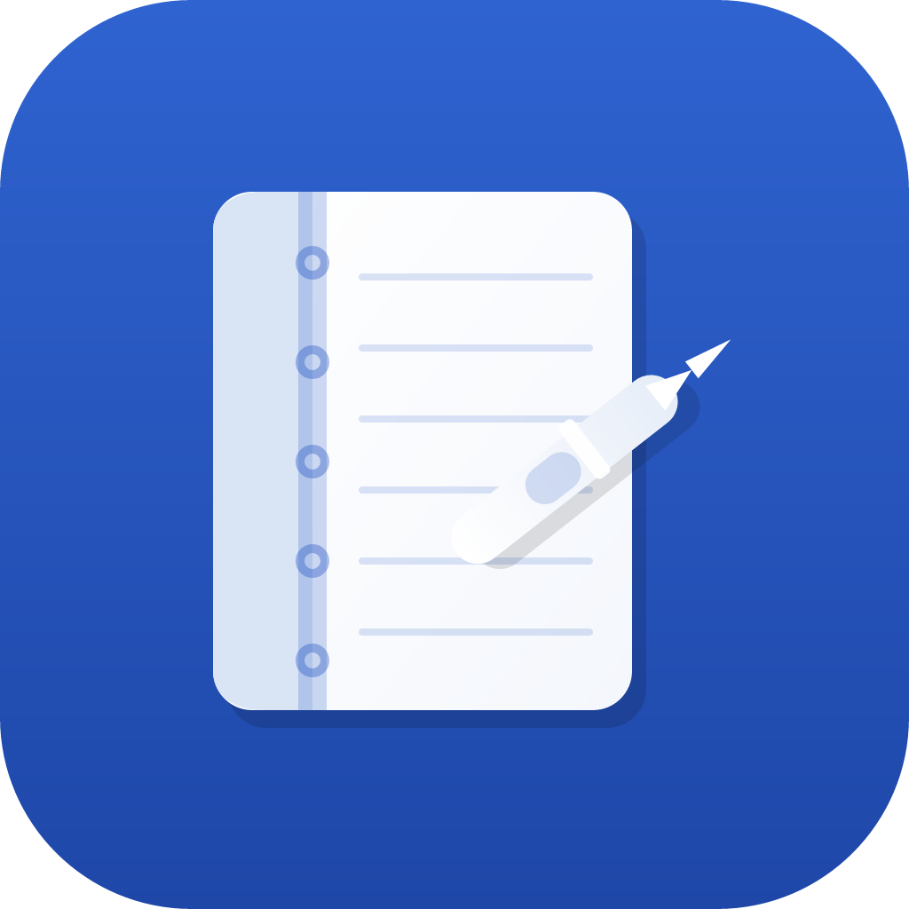

<p align="center">
  
</p>

<h1 align="center">Penfold</h1>

<p align="center">
  <strong>A local-first handwriting notebook for Android.</strong><br/>
  No accounts. No cloud. No telemetry.
</p>

<p align="center">
  <a href="https://github.com/BlommeJan/penfold"></a>
  <a href="https://flutter.dev"></a>
  <a href="https://www.android.com"></a>
  <a href="LICENSE"></a>
</p>

---

Penfold is a Flutter app that brings a **GoodNotes-style handwriting workflow** to Android tablets and phones — with one important difference: **your notebooks never leave your device.**

There is no sign-in, no sync server, and no analytics. Every stroke, image, folder, and search index lives in a single SQLite database on local storage. Open the app, pick up your stylus, and write.

| | |
|---|---|
| **Private by design** | All data in one inspectable `penfold.db` file on device |
| **Stylus-first** | Palm rejection, pressure sensitivity, S Pen hover support |
| **Organized library** | Nested folders, tags, full-text search, colored notebook covers |
| **Rich ink tools** | Pen, pencil, highlighter, tape (hide-reveal), shapes, fill, text, lasso |
| **PDF import** | Render pages once, then work fully offline |

**v0.2.7** — GoodNotes-style toolbar (back left, tools center, actions right), richer brand theme (#2455C3), vibrant library covers, and colored selection handles.

---

## Features

**Drawing** — Pressure-sensitive pen (fountain, pencil, marker, calligraphy), highlighter, whole-stroke eraser, optional stroke smoothing (Chaikin, default on), S Pen barrel-button hold-to-erase, shape recognition, flood fill, typed text blocks, lasso select with copy/paste and rotate/scale handles, and 100-step undo/redo with per-page history preserved when switching pages. Ink is stored in canonical page coordinates so strokes stay aligned when you rotate or zoom.

**Pages** — Vertical scroll through multi-page notebooks (optional page-turn mode snaps one page at a time), page overview grid with drag-reorder and multi-select batch delete, blank/lined/grid/dotted/college-ruled templates, A4/A5/Letter sizes, top-right **page info chip** (tap or gear for scrollable page settings + export), image insert, per-page audio attachment (local files, play/pause in page settings), page complexity warning at 500 strokes with split-page tool in page settings, PDF import (lazy render with read-only hyperlinks), and export current page or full notebook as PNG or vector PDF (ink strokes stay crisp at any zoom).

**Library** — Colored notebook covers with first-page thumbnails (cached locally), nested folders, notebook tags with filter chips, full-text search (FTS5 → FTS4 → LIKE fallback; PDF embedded text indexed at import), PDF import from the home screen, long-press **Export workbook** (vector PDF), Trash view with 30-day retention (restore or delete), hamburger drawer for folders/settings/trash, muted version label in the app bar, full-database backup/restore (zip export via share sheet), Settings "Your data" screen (DB path, asset folder sizes, link to `docs/ARCHITECTURE.md`), Settings **About** section (app name and version), customizable toolbar tool order in Settings, and session persistence (remembers page, scroll, and tool while editing; cold start always opens the library).

See [docs/ARCHITECTURE.md](docs/ARCHITECTURE.md) for folder layout, design patterns, and SQLite schema details.

---

## Quick start

**Prerequisites:** [Flutter SDK](https://docs.flutter.dev/get-started/install) 3.x (Dart ≥ 3.3), Android SDK, and a device or emulator.

```bash
git clone https://github.com/BlommeJan/penfold.git
cd penfold
flutter pub get
flutter run
```

No API keys, `.env` files, or sign-in steps are required.

To build a release APK, see [docs/BUILD.md](docs/BUILD.md).

---

## Screenshots

> Screenshots coming soon. Until then: imagine a clean library grid of colored notebook covers, a vertically scrolling editor with ruled paper and a floating page pill, and a toolbar of ink tools along the top.

| Library | Editor | Page overview |
|:---:|:---:|:---:|
| *Coming soon* | *Coming soon* | *Coming soon* |

---

## Documentation

| Document | Description |
|----------|-------------|
| [CHANGELOG.md](CHANGELOG.md) | Version history (v0.1.0 – v0.2.66) |
| [docs/ARCHITECTURE.md](docs/ARCHITECTURE.md) | Code layout, design patterns, SQLite schema |
| [docs/IMPLEMENTATION_ROADMAP.md](docs/IMPLEMENTATION_ROADMAP.md) | Feature feasibility, versions 0.2.7–0.2.40, dependency order |
| [docs/CONTRIBUTING.md](docs/CONTRIBUTING.md) | Development setup, tests, PR guidelines |
| [docs/BUILD.md](docs/BUILD.md) | Release APK build instructions |
| [docs/DEVICE_TESTING.md](docs/DEVICE_TESTING.md) | On-device feature checklist for QA |
| [CODE_OF_CONDUCT.md](CODE_OF_CONDUCT.md) | Community standards |
| [LICENSE](LICENSE) | MIT license |

---

## Roadmap

Penfold is under active development. These items are **not** in v0.2.7:

- Handwriting OCR search (v0.2 searches titles + typed text only)
- Pixel / stroke-splitting eraser (current eraser removes whole strokes)
- Cloud sync (intentionally out of scope)
- iOS build (Android-first; Flutter code is largely cross-platform)
- Screenshots & Play Store listing

Track progress in [CHANGELOG.md](CHANGELOG.md) and [GitHub Issues](https://github.com/BlommeJan/penfold/issues).

---

## Contributing

Issues and pull requests are welcome. Please read [docs/CONTRIBUTING.md](docs/CONTRIBUTING.md) before submitting changes.

---

<p align="center">
  <strong>Penfold v0.2.66</strong> — write freely, keep it local.
</p>
