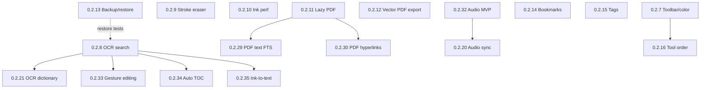

# Penfold Implementation Roadmap

> Deep implementation evaluation derived from [docs/research/SYNTHESIS.md](research/SYNTHESIS.md).  
> **Baseline:** v0.2.6 · **Ground rules:** zero cloud, zero accounts, zero payments — local/offline only.  
> **Generated:** 2026-07-15

This document evaluates every item in SYNTHESIS §1 (positives) and the priority roadmap ranks 1–15. It is research and planning only — no code changes.

---

## Version assignment key

| Version | Feature | Status |
|---------|---------|--------|
| **0.2.7** | Toolbar + color picker polish | **RESERVED** (in progress / next ship) |
| **0.2.8–0.2.99** | Approved features below | Assigned incrementally |

Only **approved** features receive a version number. Items marked DONE (already in v0.2.6) or REJECTED/DEFERRED have no version.

---

## Approved features table

| Version | Feature | Rationale | Technical approach |
|---------|---------|-----------|-------------------|
| **0.2.7** | Toolbar + color improvements | User-reserved next release; GN6 backlash showed toolbar UX is release-critical | `lib/widgets/toolbar.dart`, `ToolState` in `drawing_canvas.dart`; expanded color palettes, pen/highlighter/fill pickers; keep undo in center cluster (anti-pattern guard) |
| **0.2.8** | On-device handwriting OCR search | #1 competitive gap vs GoodNotes; Squid's top request for 10+ years | `google_mlkit_text_recognition` (on-device, no network) **or** `tesseract_ocr` + bundled `tessdata`; new `lib/services/ink_ocr_service.dart` (isolate worker); schema v4: `ink_index(page_id, stroke_id, text, status)` + extend FTS `body`; UI: per-page indexed/pending badge in `page_overview_screen.dart`; background queue on stroke commit |
| **0.2.9** | Pixel / stroke-splitting eraser | Table stakes; current eraser deletes whole strokes (`_eraseAt` in `drawing_canvas.dart`) | New `lib/services/stroke_eraser.dart`: clip polyline at eraser-circle intersections, emit 0–N segment strokes; `_ErasePartial` undo action; eraser mode toggle (whole-stroke vs partial) in toolbar sheet |
| **0.2.10** | Ink latency & stroke fidelity hardening | Samsung Notes / GoodNotes Android regressions create opening; must be release blocker | Profile `drawing_canvas.dart` pointer path; optional `RepaintBoundary` per page; coalesce points with adaptive min-distance; benchmark harness in `test/ink_perf_test.dart`; document Tab S6 Lite + flagship targets in release checklist; no new packages |
| **0.2.11** | Large-PDF performance (no blank/flicker) | Students live in slide decks; import currently renders **all** pages to PNG at once (`pdf_import.dart`) | Schema v4: `pages.pdf_source_path`, `pages.pdf_page_index`; lazy render via existing `pdfx`; new `lib/services/pdf_page_cache.dart` (LRU, max N decoded bitmaps); pre-render ±1 adjacent page in isolate; `page_editor.dart` shows placeholder never blank |
| **0.2.12** | High-quality PDF export (vector ink, alpha highlighter) | Current export rasterizes full page to PNG then embeds (`page_export.dart` `buildPdfBytes`) | Extend `page_export.dart`: emit vector paths via `pdf` package `pw.CustomPaint` for pen strokes; highlighter as separate layer with `PdfGraphics.setBlendMode`; 300 DPI raster fallback for fills/images; regression test vs Samsung opaque-highlighter case |
| **0.2.13** | Full-database backup + safe restore | Answers sync/data-loss anxiety; Squid restore-wipes-all anti-pattern | New `lib/services/backup_service.dart`: zip `penfold.db` + `pdf_pages/` + `images/` via `archive`; export via `share_plus`; restore flow: pre-restore auto-copy current DB → confirm dialog → replace or merge; settings screen entry |
| **0.2.14** | Page bookmarks + quick jump | Low effort, high daily use in long notebooks | Schema v4: `pages.bookmarked INTEGER DEFAULT 0`; bookmark toggle in page settings + overview grid icon; editor toolbar prev/next bookmark buttons in `notebook_screen.dart` |
| **0.2.15** | Tags on notebooks | Folders break at scale; GoodNotes still lacks tags | Schema v4: `tags(id, name)`, `notebook_tags(notebook_id, tag_id)`; tag chips in `library_screen.dart` filter row; tag editor in notebook long-press menu |
| **0.2.16** | Toolbar tool order customization | GN6 backlash; cheap retention win | `SharedPreferences` or SQLite `settings` table: ordered tool IDs; drag-reorder UI in settings; `toolbar.dart` renders from saved order; undo/redo position locked in center |
| **0.2.17** | Tape / hide-reveal study tool | GoodNotes differentiator; pure local ink | Extend `ToolType.tape` in `models.dart`; semi-transparent stroke with `hidden` flag in `strokes` table or JSON metadata; tap-to-toggle in `drawing_canvas.dart`; export includes tape layer in PDF |
| **0.2.18** | Per-page template/size change | Noteshelf gap; notebook-level default exists but per-page override is partial | Already has `pages.template`, `pages.page_size` — expose in page settings sheet (`notebook_screen.dart`); re-layout canonical coords on size change with warning if ink exists |
| **0.2.19** | Mixed-orientation pages in one notebook | Samsung Notes forces split notes; schema already has per-page `aspect` | Schema v4: `pages.orientation INTEGER` (0=portrait, 1=landscape); swap width/height in `PageCoords` when rendering; page settings toggle |
| **0.2.20** | Audio recording + stroke timestamps | Notability moat for students; local files only | `record` package + `permission_handler`; schema v4: `audio_clips(id, page_id, path, duration_ms)`, add `strokes.timestamp_ms`; tap stroke → seek via `just_audio`; record button in toolbar |
| **0.2.21** | OCR custom dictionary | Nebo proves domain jargon matters; depends on 0.2.8 | Schema v4: `ocr_terms(term)`; feed terms as ML Kit hint list or Tesseract user-words file; settings UI to add/remove terms |
| **0.2.22** | Play Store listing + screenshots | Discovery gap; no code feature but required for growth | Capture on Tab S6 Lite + flagship; `fastlane` or manual; update README screenshots table; privacy policy (no data collection — easy) |
| **0.2.23** | Notebook library thumbnails | SYNTHESIS §1 org: first-page mini-render on cover | Reuse `PageOverviewScreen` thumbnail painter; cache PNG in `thumbnails/{notebook_id}.png` on first open; `library_screen.dart` cover widget |
| **0.2.24** | Lasso rotate handles | SYNTHESIS §1 ink: selection has rotate, lasso is move-only | Port rotate handle logic from selection tool (`_SelHandle.rotate`) to lasso selection path in `drawing_canvas.dart` |
| **0.2.25** | Stroke smoothing toggle | Samsung Notes users request; default on | `ToolState.strokeSmoothing`; Chaikin or moving-average on point stream before commit; settings toggle |
| **0.2.26** | S Pen button behavior settings | Document/configure barrel button | `SharedPreferences`: map button → tool (pen/eraser/lasso); listen via Android platform channel or `samsung_pen` if needed; fallback: document in settings |
| **0.2.27** | Session persistence (open-and-write speed) | Cold start → last notebook <1 s | Schema v4: `session(last_notebook_id, last_page_idx, scroll_offset, tool, zoom)`; `main.dart` route to last notebook; restore tool state in `ToolState` |
| **0.2.28** | Page overview drag-reorder + multi-select delete | SYNTHESIS §1 UX: grid exists, reorder missing | `ReorderableGridView` or custom drag in `page_overview_screen.dart`; batch delete with confirm; update `pages.idx` in transaction |
| **0.2.29** | PDF embedded text search at import | SYNTHESIS §1 search: extract PDF text to FTS | On import, extract text per page via `pdf` package `PdfDocument` text extraction; insert into FTS `body` immediately (before OCR) |
| **0.2.30** | PDF hyperlinks (read-only) | Preserve clickable links in imported PDF layer | If lazy PDF render (0.2.11): overlay `Link` widgets from parsed annotation rects; read-only tap opens URL via `url_launcher` (offline-safe: only opens cached/local) |
| **0.2.31** | Optional page-turn scroll mode | Squid-style paging preference | Settings flag; `notebook_screen.dart` swap `CustomScrollView` for `PageView` when enabled |
| **0.2.32** | Page-level audio attachment (MVP) | Minimum before stroke-sync (0.2.20) | Attach audio file to page without per-stroke timestamps; simpler schema: `pages.audio_path`; play/pause in page settings |
| **0.2.33** | Gesture ink editing | Scratch-to-erase, underline-to-emphasize; **requires OCR index** | Post-0.2.8: gesture recognizer on indexed stroke bounds; never delete unrecognized strokes on pen-up |
| **0.2.34** | Auto table of contents | From typed headings + OCR ink headings | Parse `TextBlock` style levels + OCR heading heuristics; generate TOC page or PDF outline in export |
| **0.2.35** | Handwriting-to-text conversion (selection) | Optional convert lasso selection to `TextBlock` | OCR selected stroke bounds via 0.2.8 engine; insert text block; keep original ink unless user deletes |
| **0.2.36** | Page complexity warning + split page | OneNote "page too full" anti-pattern | Count strokes per page; warn at threshold (e.g. 2000); "split page" duplicates template, moves half the strokes |
| **0.2.37** | "Your data" settings screen | Backup confusion anti-pattern (Samsung) | Settings screen: show DB path, folder sizes, backup/restore links, link to ARCHITECTURE.md |
| **0.2.38** | Undo boundary persist on page switch | SYNTHESIS §1: accidental navigation loses redo | Serialize undo stack per page in memory (or SQLite for crash recovery); restore when returning to page |
| **0.2.39** | OCR ink export as plain text / Markdown | Phase 2 editable export | Export notebook as `.md` with OCR text per page; uses `ink_index` table |
| **0.2.40** | Math recognition / LaTeX export | Phase 3; Nebo strength but low priority vs core UX | Evaluate on-device math OCR (ML Kit limited); likely defer until core OCR proven; export LaTeX string to share sheet |

---

## Per-feature deep evaluation

### SYNTHESIS §1 — Ink & input

#### 1. Low-latency S Pen feel
| Field | Value |
|-------|-------|
| Feasibility | **High** — Flutter pointer events + canonical coords already shipped |
| Approach | Benchmark-driven hardening in `drawing_canvas.dart`, `pointer_routing.dart`; release checklist on real Tab hardware; consider Android `requestDirectStylusWriting` via platform channel on API 34+ |
| Effort | 3–5 days (ongoing, not one-shot) |
| Approved | **YES** → **v0.2.10** (rank 3) |
| Notes | Already partially shipped; this is regression prevention + tuning |

#### 2. Natural pressure-sensitive ink
| Field | Value |
|-------|-------|
| Feasibility | **High** — pressure in `StrokePoint.p`, brush styles exist |
| Approach | Tune curves per `BrushStyle` in `painters.dart`; hardware QA on Galaxy Tab |
| Effort | 2 days |
| Approved | **YES** (ongoing polish, bundled into v0.2.10) |
| Notes | Shipped baseline; expansion is tuning not greenfield |

#### 3. Partial / pixel eraser
| Field | Value |
|-------|-------|
| Feasibility | **Medium** — pure Dart geometry; no native SDK needed |
| Approach | `lib/services/stroke_eraser.dart`; modify `_eraseAt`; new undo action type |
| Effort | 5–8 days |
| Approved | **YES** → **v0.2.9** (rank 2) |

#### 4. Shape recognition + lasso editing
| Field | Value |
|-------|-------|
| Feasibility | **High** — shape snap shipped; lasso move/copy shipped |
| Approach | Rotate handles for lasso → **v0.2.24**; selection tool already has scale/rotate |
| Effort | 2–3 days (lasso rotate only) |
| Approved | **YES** → **v0.2.24** |

#### 5. Gesture ink editing
| Field | Value |
|-------|-------|
| Feasibility | **Medium** — depends on OCR index |
| Approach | Gesture layer on indexed strokes only; see v0.2.33 |
| Effort | 5–7 days (after OCR) |
| Approved | **YES** → **v0.2.33** (blocked by 0.2.8) |

#### 6. Palm rejection + stylus-only mode
| Field | Value |
|-------|-------|
| Feasibility | **High** — shipped (`DrawGestureShield`, `ToolState.stylusOnly`) |
| Approach | S Pen button config → **v0.2.26** |
| Effort | 1–2 days (settings only) |
| Approved | **YES** (core shipped; button config v0.2.26) |

---

### SYNTHESIS §1 — Organization

#### 7. Nested folders + colored covers
| Field | Value |
|-------|-------|
| Feasibility | **High** — shipped (`parent_id`, cover colors) |
| Approach | Library thumbnails → **v0.2.23** |
| Effort | 2 days (thumbnails) |
| Approved | **YES** → **v0.2.23** (incremental) |

#### 8. Tags / multi-axis organization
| Field | Value |
|-------|-------|
| Feasibility | **High** — standard SQLite junction table |
| Approach | See approved table v0.2.15 |
| Effort | 3–4 days |
| Approved | **YES** → **v0.2.15** (rank 8) |

#### 9. Page bookmarks + quick jump
| Field | Value |
|-------|-------|
| Feasibility | **High** |
| Approach | See v0.2.14 |
| Effort | 2 days |
| Approved | **YES** → **v0.2.14** (rank 7) |

#### 10. Shallow, obvious library navigation
| Field | Value |
|-------|-------|
| Feasibility | **High** — already ≤2 taps |
| Approach | Session persistence (v0.2.27): default new notebook to last template/size; no wizard |
| Effort | 1 day (prefs) |
| Approved | **YES** → **v0.2.27** |

#### 11. Auto table of contents
| Field | Value |
|-------|-------|
| Feasibility | **Medium** — needs OCR for ink headings |
| Approach | See v0.2.34 |
| Effort | 4–5 days |
| Approved | **YES** → **v0.2.34** (blocked by 0.2.8) |

---

### SYNTHESIS §1 — Search

#### 12. Full-text library search
| Field | Value |
|-------|-------|
| Feasibility | **High** — shipped (FTS5/FTS4/LIKE) |
| Approved | **DONE** (v0.2.1+) |
| Maintenance | FTS regression tests in CI (already in `test/database_test.dart`; extend) |

#### 13. Handwriting OCR search
| Field | Value |
|-------|-------|
| Feasibility | **Medium** — on-device OCR quality varies; ML Kit acceptable for search (not perfect transcription) |
| Approach | See v0.2.8; **reject** cloud OCR (Google Cloud Vision, etc.) |
| Packages | `google_mlkit_text_recognition: ^0.14.0` (primary) or `tesseract_ocr` (fallback, larger APK) |
| Schema | v4: `ink_index`, extend `search_index.body` rebuild |
| Files | `ink_ocr_service.dart`, `app_database.dart`, `library_screen.dart`, `page_overview_screen.dart` |
| Effort | 10–15 days |
| Approved | **YES** → **v0.2.8** (rank 1) |
| Rejected alt | MyScript SDK (commercial license cost — violates zero-payments principle for OSS project) |

#### 14. PDF text search
| Field | Value |
|-------|-------|
| Feasibility | **High** — text layer in PDF is extractable locally |
| Approach | See v0.2.29; runs at import in `pdf_import.dart` |
| Effort | 3–4 days |
| Approved | **YES** → **v0.2.29** |

#### 15. Custom dictionary for OCR
| Field | Value |
|-------|-------|
| Feasibility | **High** (once OCR exists) |
| Approach | See v0.2.21 |
| Effort | 2 days |
| Approved | **YES** → **v0.2.21** (rank 14, blocked by 0.2.8) |

---

### SYNTHESIS §1 — Export & backup

#### 16. Reliable PNG/PDF export
| Field | Value |
|-------|-------|
| Approved | **DONE** (v0.2.5) |

#### 17. High-quality PDF export
| Field | Value |
|-------|-------|
| Feasibility | **Medium** — vector PDF generation is more complex than raster |
| Approach | See v0.2.12 |
| Effort | 5–7 days |
| Approved | **YES** → **v0.2.12** (rank 5) |

#### 18. Full-database backup
| Field | Value |
|-------|-------|
| Feasibility | **High** |
| Approach | See v0.2.13; package `archive: ^3.6.0` |
| Effort | 4–5 days |
| Approved | **YES** → **v0.2.13** (rank 6) |

#### 19. Editable export formats (Word, LaTeX, Markdown)
| Field | Value |
|-------|-------|
| Feasibility | **Medium** (Markdown/plain) / **Low** (Word/LaTeX without cloud) |
| Approach | Markdown/plain text → v0.2.39; Word/LaTeX deferred |
| Effort | 3 days (Markdown) |
| Approved | **YES** (Markdown only) → **v0.2.39** |

#### 20. Standard formats only
| Field | Value |
|-------|-------|
| Approved | **DONE** (principle) — document in README + v0.2.37 "Your data" screen |

---

### SYNTHESIS §1 — PDF

#### 21. Import PDF, annotate offline
| Field | Value |
|-------|-------|
| Approved | **DONE** (`pdf_import.dart`, `pdfx`) |

#### 22. Large-PDF performance
| Field | Value |
|-------|-------|
| Feasibility | **Medium** — lazy load requires refactor of import + render pipeline |
| Approach | See v0.2.11 |
| Effort | 7–10 days |
| Approved | **YES** → **v0.2.11** (rank 4) |

#### 23. PDF hyperlinks (read-only)
| Field | Value |
|-------|-------|
| Feasibility | **Medium** — depends on lazy PDF render (0.2.11) |
| Approach | See v0.2.30 |
| Effort | 3–4 days |
| Approved | **YES** → **v0.2.30** (blocked by 0.2.11) |

#### 24. Orientation-agnostic pages
| Field | Value |
|-------|-------|
| Feasibility | **High** — per-page `aspect` already exists |
| Approach | See v0.2.19 |
| Effort | 2–3 days |
| Approved | **YES** → **v0.2.19** (rank 12) |

---

### SYNTHESIS §1 — UX polish

#### 25. "Open and write" speed
| Field | Value |
|-------|-------|
| Feasibility | **High** |
| Approach | See v0.2.27 |
| Effort | 2–3 days |
| Approved | **YES** → **v0.2.27** |

#### 26. GoodNotes-style toolbar
| Field | Value |
|-------|-------|
| Approved | **DONE** (v0.2.3); customization → **v0.2.16** (rank 9), color → **v0.2.7** |

#### 27. Page overview with real thumbnails
| Field | Value |
|-------|-------|
| Approved | **DONE** (v0.2.3); reorder/multi-delete → **v0.2.28** |

#### 28. 100-step undo/redo
| Field | Value |
|-------|-------|
| Approved | **DONE** (`_undoStack.length > 100`); page-switch persist → **v0.2.38** |

#### 29. Vertical scroll + page boundaries
| Field | Value |
|-------|-------|
| Approved | **DONE**; optional page-turn → **v0.2.31** |

#### 30. Templates + page sizes
| Field | Value |
|-------|-------|
| Approved | **DONE**; per-page change → **v0.2.18** (rank 11) |

#### 31. Tape / hide-reveal study tool
| Field | Value |
|-------|-------|
| Feasibility | **High** — new stroke type + tap toggle |
| Approach | See v0.2.17 |
| Effort | 4–5 days |
| Approved | **YES** → **v0.2.17** (rank 10) |

---

### SYNTHESIS §1 — Audio & lecture capture

#### 32. Audio synced to ink
| Field | Value |
|-------|-------|
| Feasibility | **Medium** — local recording straightforward; sync requires timestamp discipline |
| Approach | See v0.2.20; packages: `record`, `just_audio`, `permission_handler` |
| Effort | 8–12 days |
| Approved | **YES** → **v0.2.20** (rank 13) |

#### 33. Voice recording without sync
| Field | Value |
|-------|-------|
| Feasibility | **High** |
| Approach | See v0.2.32 (MVP before 0.2.20) |
| Effort | 2–3 days |
| Approved | **YES** → **v0.2.32** |

---

### SYNTHESIS §1 — Study & conversion (later phase)

#### 34. Handwriting-to-text conversion
| Field | Value |
|-------|-------|
| Feasibility | **Medium** (with on-device OCR) |
| Approved | **YES** → **v0.2.35** (blocked by 0.2.8) |

#### 35. Math recognition / LaTeX
| Field | Value |
|-------|-------|
| Feasibility | **Low** on-device in Flutter without commercial SDK |
| Approved | **YES** (low priority) → **v0.2.40** |

#### 36. AI summarization / quizzes
| Field | Value |
|-------|-------|
| Feasibility | N/A |
| Approved | **NO — REJECTED** |
| Reason | Violates ground rules (network dependency, credit meters, scope creep). Even on-device LLM would bloat APK and distract from core ink UX. Explicitly deferred in SYNTHESIS. |

---

### Priority roadmap ranks 1–15 (summary)

| Rank | Item | Version | Approved |
|------|------|---------|----------|
| 1 | On-device handwriting OCR search | 0.2.8 | YES |
| 2 | Pixel / stroke-splitting eraser | 0.2.9 | YES |
| 3 | Ink latency & stroke fidelity hardening | 0.2.10 | YES |
| 4 | Large-PDF performance | 0.2.11 | YES |
| 5 | High-quality PDF export | 0.2.12 | YES |
| 6 | Full-database backup + safe restore | 0.2.13 | YES |
| 7 | Page bookmarks + quick jump | 0.2.14 | YES |
| 8 | Tags on notebooks | 0.2.15 | YES |
| 9 | Toolbar customization | 0.2.16 (+ 0.2.7 color) | YES |
| 10 | Tape / hide-reveal | 0.2.17 | YES |
| 11 | Per-page template/size change | 0.2.18 | YES |
| 12 | Mixed-orientation pages | 0.2.19 | YES |
| 13 | Audio + stroke timestamps | 0.2.20 | YES |
| 14 | OCR custom dictionary | 0.2.21 | YES |
| 15 | Play Store listing + screenshots | 0.2.22 | YES |

---

## Rejected / deferred

| Item | Verdict | Reason |
|------|---------|--------|
| Cloud sync | **REJECTED** | Ground rules: zero cloud |
| Real-time collaboration | **REJECTED** | Requires server |
| Accounts / sign-in | **REJECTED** | Ground rules |
| Subscriptions / paywalls / usage meters | **REJECTED** | Ground rules + MIT ethos |
| AI summarization / quizzes | **REJECTED** | Scope + upsell anti-pattern |
| Nebo-style real-time ink reflow | **REJECTED** | Deletes/vanishes strokes; conflicts with freeform ink model |
| iOS build | **DEFERRED** | Android-first per SYNTHESIS |
| Marketplace / sticker store | **DEFERRED** | Not local-first priority |
| MyScript SDK (commercial) | **REJECTED** | Paid license conflicts with zero-payments OSS; use ML Kit |
| Cloud OCR (Vision API, etc.) | **REJECTED** | Ground rules |
| Proprietary `.penfold` archive as only export | **REJECTED** | Standard formats only (SQLite + PNG/PDF) |
| Infinite canvas as default | **REJECTED** | Structured pages are default; infinite only if explicitly requested later |
| Word/DOCX export | **DEFERRED** | Low priority vs Markdown; no cloud-based conversion |

---

## Dependency order



### Recommended implementation waves

**Wave A (0.2.7–0.2.10)** — Core writing feel  
0.2.7 → 0.2.9 → 0.2.10 (toolbar, eraser, perf; OCR can start in parallel)

**Wave B (0.2.8, 0.2.11–0.2.13)** — Search & trust  
0.2.8 OCR (largest) ∥ 0.2.11 lazy PDF → 0.2.12 export → 0.2.13 backup

**Wave C (0.2.14–0.2.19)** — Organization polish  
Bookmarks, tags, templates, orientation — mostly independent

**Wave D (0.2.17, 0.2.20–0.2.22)** — Study & ship  
Tape, audio, Play Store

**Wave E (0.2.21+)** — OCR-dependent features  
Dictionary, gestures, TOC, ink-to-text, Markdown export

### Hard blockers

| Feature | Blocked by |
|---------|------------|
| 0.2.21 OCR dictionary | 0.2.8 |
| 0.2.29 PDF text search | 0.2.11 (lazy import refactor touches same code) |
| 0.2.30 PDF hyperlinks | 0.2.11 |
| 0.2.33 Gesture editing | 0.2.8 |
| 0.2.34 Auto TOC | 0.2.8 |
| 0.2.35 Ink-to-text | 0.2.8 |
| 0.2.20 Audio sync | 0.2.32 (recommended MVP first) |

---

## Schema migration plan (v3 → v4)

Proposed **schema version 4** bundles (can ship incrementally with feature flags):

```sql
-- OCR
CREATE TABLE ink_index (
  id TEXT PRIMARY KEY,
  page_id TEXT NOT NULL REFERENCES pages(id) ON DELETE CASCADE,
  stroke_id TEXT REFERENCES strokes(id) ON DELETE CASCADE,
  text TEXT NOT NULL,
  status INTEGER NOT NULL DEFAULT 0,  -- 0=pending 1=indexed 2=failed
  indexed_at INTEGER
);
CREATE TABLE ocr_terms (term TEXT PRIMARY KEY);

-- Organization
CREATE TABLE tags (id TEXT PRIMARY KEY, name TEXT NOT NULL UNIQUE);
CREATE TABLE notebook_tags (notebook_id TEXT NOT NULL, tag_id TEXT NOT NULL,
  PRIMARY KEY (notebook_id, tag_id));
ALTER TABLE pages ADD COLUMN bookmarked INTEGER NOT NULL DEFAULT 0;
ALTER TABLE pages ADD COLUMN orientation INTEGER NOT NULL DEFAULT 0;

-- PDF lazy load
ALTER TABLE pages ADD COLUMN pdf_source_path TEXT;
ALTER TABLE pages ADD COLUMN pdf_page_index INTEGER;

-- Audio
CREATE TABLE audio_clips (
  id TEXT PRIMARY KEY,
  page_id TEXT NOT NULL REFERENCES pages(id) ON DELETE CASCADE,
  path TEXT NOT NULL,
  duration_ms INTEGER NOT NULL,
  created_at INTEGER NOT NULL
);
ALTER TABLE strokes ADD COLUMN timestamp_ms INTEGER;
ALTER TABLE strokes ADD COLUMN tape_hidden INTEGER NOT NULL DEFAULT 0;

-- Session
CREATE TABLE session (
  id INTEGER PRIMARY KEY CHECK (id = 1),
  last_notebook_id TEXT,
  last_page_idx INTEGER,
  scroll_offset REAL,
  tool INTEGER,
  updated_at INTEGER
);
```

Migration rules: automatic on upgrade; never destructive; backup prompt before v4 upgrade (0.2.13 should ship before or alongside first v4 migration).

---

## Anti-patterns checklist (SYNTHESIS §2)

Use this checklist before every release and in PR review:

- [ ] **No subscription / usage meters** — all features fully usable
- [ ] **No sign-in screen** — first launch → library
- [ ] **No sync server** — single device is source of truth
- [ ] **No silent data overwrite** — restore requires explicit confirm + pre-backup
- [ ] **No cloud OCR / cloud AI** — indexing runs on-device only
- [ ] **FTS regression test passes** — create note → search body → hit
- [ ] **Ink perf benchmark** — no dropped strokes on Tab S6 Lite + flagship
- [ ] **Export stress test** — 50+ page notebook, cancel works, no infinite spinner
- [ ] **Highlighter alpha in PDF** — not opaque blocks (Samsung regression case)
- [ ] **Strokes never vanish on pen-up** — OCR indexes, never deletes source ink
- [ ] **Undo stays in center toolbar** — not by back button
- [ ] **PDF import stays free** — no paywall
- [ ] **Standard exports only** — PNG, PDF, SQLite backup, optional Markdown
- [ ] **No proprietary lock-in** — schema documented in ARCHITECTURE.md
- [ ] **No in-app upsell on writing surface** — donate link in settings/about only
- [ ] **Search works on all Android devices** — FTS5 → FTS4 → LIKE chain intact
- [ ] **Destructive restore prevented** — merge or typed "REPLACE" confirm
- [ ] **Large notebook guardrails** — complexity warning, lazy render, no "page full" hard block

---

## Agent spawn list (approved features + versions)

Copy-paste ready for implementation agents:

```
0.2.7  — Toolbar + color picker polish (RESERVED)
0.2.8  — On-device handwriting OCR search
0.2.9  — Pixel / stroke-splitting eraser
0.2.10 — Ink latency & stroke fidelity hardening
0.2.11 — Large-PDF lazy load performance
0.2.12 — High-quality vector PDF export
0.2.13 — Full-database backup + safe restore
0.2.14 — Page bookmarks + quick jump
0.2.15 — Tags on notebooks
0.2.16 — Toolbar tool order customization
0.2.17 — Tape / hide-reveal study tool
0.2.18 — Per-page template/size change
0.2.19 — Mixed-orientation pages
0.2.20 — Audio recording + stroke timestamps
0.2.21 — OCR custom dictionary
0.2.22 — Play Store listing + screenshots
0.2.23 — Notebook library thumbnails
0.2.24 — Lasso rotate handles
0.2.25 — Stroke smoothing toggle
0.2.26 — S Pen button behavior settings
0.2.27 — Session persistence (open-and-write)
0.2.28 — Page overview drag-reorder + multi-delete
0.2.29 — PDF embedded text search at import
0.2.30 — PDF hyperlinks (read-only)
0.2.31 — Optional page-turn scroll mode
0.2.32 — Page-level audio attachment (MVP)
0.2.33 — Gesture ink editing (post-OCR)
0.2.34 — Auto table of contents
0.2.35 — Handwriting-to-text conversion
0.2.36 — Page complexity warning + split page
0.2.37 — "Your data" settings screen
0.2.38 — Undo boundary persist on page switch
0.2.39 — OCR ink export as Markdown
0.2.40 — Math recognition / LaTeX export (low priority)
```

---

*Roadmap version: 2026-07-15 · Penfold v0.2.6 baseline*
